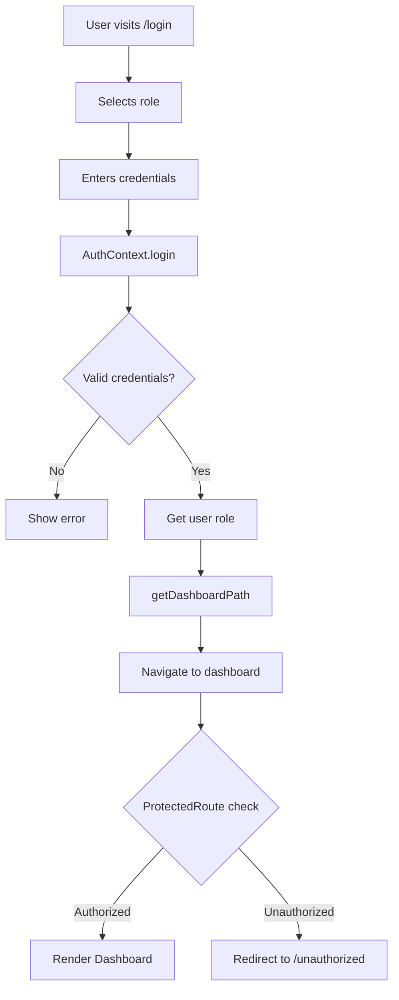
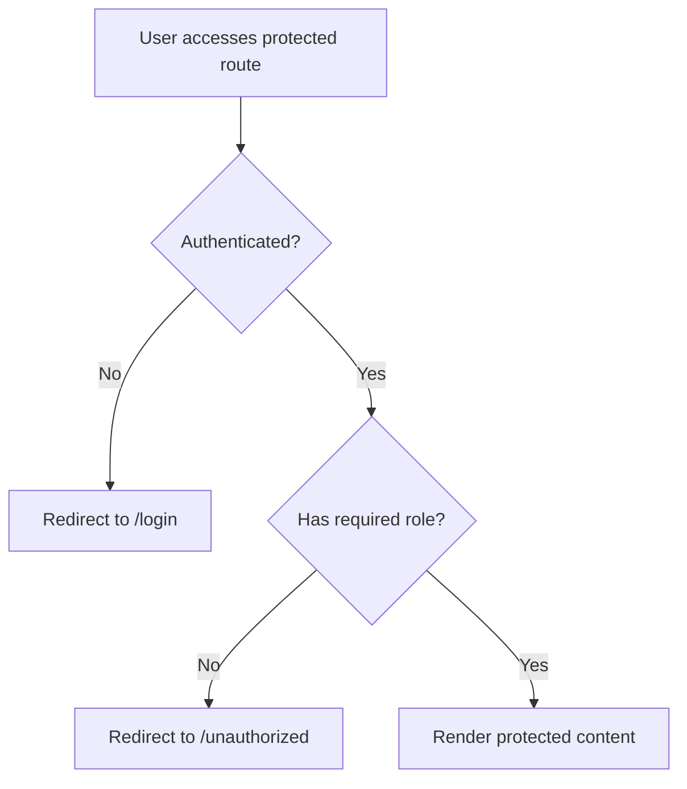

# Role-Based Routing Implementation Guide

## Overview

This document explains the role-based routing system implemented in VerityGuard. The system ensures that users are redirected to their appropriate dashboards after login based on their assigned role, and prevents unauthorized access to protected routes.

## Role Hierarchy

The system implements a hierarchical role structure:

1. **Super Admin** (`super-admin`) - Highest level, full access to all routes
2. **Moderator** (`moderator`) - Can access moderator, contributor, and user routes
3. **Contributor** (`contributor`) - Can access contributor and user routes
4. **User** (`user`) - Basic level, can only access user routes

## Dashboard Paths

Each role has a dedicated dashboard path:

| Role | Dashboard Path |
|------|----------------|
| Super Admin | `/dashboard/admin` |
| Moderator | `/dashboard/moderator` |
| Contributor | `/dashboard/contributor` |
| User | `/dashboard/user` |

## Key Components

### 1. AuthContext (src/contexts/AuthContext.js)

The authentication context handles login and signup, automatically determining the correct redirect path based on user role.

**Key Features:**
- `login()` function returns `redirectTo` path based on role
- `signup()` function also returns role-specific redirect path
- Uses `getDashboardPath()` from roles utility

**Code Example:**
```javascript
const login = (email, password) => {
  // ... authentication logic ...
  
  return { 
    success: true, 
    user: userSession, 
    redirectTo: getDashboardPath(foundUser.role) 
  };
};
```

### 2. ProtectedRoute Component (src/components/ProtectedRoute.js)

This wrapper component protects routes by verifying:
1. User is authenticated
2. User has the required role or is in the allowed roles list

**Usage Examples:**

```javascript
// Hierarchical access - Admin, Moderator can also access
<ProtectedRoute requiredRole={ROLES.CONTRIBUTOR}>
  <ContributorDashboard />
</ProtectedRoute>

// Exact match - Only specified roles allowed
<ProtectedRoute allowedRoles={[ROLES.MODERATOR, ROLES.SUPER_ADMIN]}>
  <ModerationPanel />
</ProtectedRoute>
```

**Access Control Logic:**
- If not authenticated → Redirect to `/login`
- If authenticated but wrong role → Redirect to `/unauthorized`
- If authorized → Render protected content

### 3. RedirectByRole Component (src/components/RedirectByRole.js)

A utility component that automatically redirects authenticated users to their role-specific dashboard.

**Usage:**
```javascript
<Route path="/dashboard" element={<RedirectByRole />} />
```

**Behavior:**
- Checks authentication status
- Gets appropriate dashboard path for user's role
- Redirects to that dashboard
- Shows loading state during redirect

### 4. Roles Utility (src/utils/roles.js)

Contains role definitions, permissions, and helper functions.

**Key Functions:**

```javascript
// Get dashboard path for a role
getDashboardPath(role) // Returns: '/dashboard/{role}'

// Check if user can access a dashboard (hierarchical)
canAccessDashboard(userRole, requiredRole) // Returns: boolean

// Check if user has specific permission
hasPermission(role, permission) // Returns: boolean
```

## Route Configuration (src/App.js)

The main app routes are configured with role-based protection:

```javascript
<Routes>
  {/* Public Routes */}
  <Route path="/" element={<HomePage />} />
  <Route path="/login" element={<LoginOptions />} />
  <Route path="/unauthorized" element={<Unauthorized />} />
  
  {/* Auto-redirect to role-specific dashboard */}
  <Route path="/dashboard" element={<RedirectByRole />} />
  
  {/* Protected Dashboards */}
  <Route
    path="/dashboard/admin"
    element={
      <ProtectedRoute requiredRole={ROLES.SUPER_ADMIN}>
        <AdminDashboard />
      </ProtectedRoute>
    }
  />
  
  <Route
    path="/dashboard/moderator"
    element={
      <ProtectedRoute requiredRole={ROLES.MODERATOR}>
        <ModeratorDashboard />
      </ProtectedRoute>
    }
  />
  
  <Route
    path="/dashboard/contributor"
    element={
      <ProtectedRoute requiredRole={ROLES.CONTRIBUTOR}>
        <ContributorDashboard />
      </ProtectedRoute>
    }
  />
  
  <Route
    path="/dashboard/user"
    element={
      <ProtectedRoute requiredRole={ROLES.USER}>
        <UserDashboard />
      </ProtectedRoute>
    }
  />
</Routes>
```

## Dashboard Components

### User Dashboard (src/pages/user/UserDashboard.js)
- Default dashboard for regular users
- Features: Reading activity, saved articles, recommended content
- Navigation: Dashboard, Articles, Saved Items, History, Settings, Profile

### Contributor Dashboard (src/pages/contributor/ContributorDashboard.js)
- For content creators
- Features: Draft management, analytics, published articles
- Navigation: Dashboard, Create Content, Drafts, Published, Analytics, Media, Profile

### Moderator Dashboard (src/pages/moderator/ModeratorDashboard.js)
- For content moderators
- Features: Review queue, flagged content, moderation history
- Navigation: Dashboard, Queue, Flagged, Reports, History, Analytics, Guidelines

### Admin Dashboard (src/pages/admin/AdminDashboard.js)
- For super administrators
- Features: User management, system health, audit logs, settings
- Navigation: Dashboard, Users, Roles, Content, Analytics, Audit Logs, Settings, Security

## Authentication Flow

### Login Process



### Access Control Flow



## Security Features

1. **Authentication Check**: All protected routes verify user authentication
2. **Role Verification**: Each route checks if user has appropriate role
3. **Hierarchical Access**: Higher-level roles can access lower-level routes
4. **Session Management**: User session stored in localStorage
5. **Redirect Protection**: Unauthorized access attempts redirect to appropriate pages

## Testing Role-Based Access

To test different roles:

1. **Create test users** with different roles:
   ```javascript
   // In signup, specify role
   signup({
     name: "Test Admin",
     email: "admin@test.com",
     password: "password123",
     role: "super-admin"
   })
   ```

2. **Login with each role** and verify:
   - Correct dashboard is displayed
   - Navigation links point to correct paths
   - Cannot access other role dashboards

3. **Test unauthorized access**:
   - Login as a regular user
   - Try to access `/dashboard/admin` directly
   - Should redirect to `/unauthorized`

## Common Use Cases

### Adding a New Protected Route

```javascript
// 1. Add route in App.js
<Route
  path="/dashboard/admin/new-feature"
  element={
    <ProtectedRoute requiredRole={ROLES.SUPER_ADMIN}>
      <NewFeature />
    </ProtectedRoute>
  }
/>

// 2. Add navigation link in AdminDashboard.js
const navigation = [
  // ... existing items
  { path: '/dashboard/admin/new-feature', icon: '🆕', label: 'New Feature' },
];
```

### Creating a Role-Specific Component

```javascript
import { useAuth } from '../contexts/AuthContext';
import { ROLES } from '../utils/roles';

function MyComponent() {
  const { user } = useAuth();
  
  return (
    <div>
      {user.role === ROLES.SUPER_ADMIN && (
        <AdminOnlyContent />
      )}
      <RegularContent />
    </div>
  );
}
```

### Checking Permissions in Components

```javascript
import { hasPermission, PERMISSIONS } from '../utils/roles';

function ContentEditor() {
  const { user } = useAuth();
  const canEdit = hasPermission(user.role, PERMISSIONS.EDIT_OWN_CONTENT);
  
  return (
    <div>
      {canEdit && <EditButton />}
      <ViewContent />
    </div>
  );
}
```

## Migration Notes

If you were using the old path structure (`/{role}/dashboard`), update:

### Old Paths → New Paths
- `/admin/dashboard` → `/dashboard/admin`
- `/moderator/dashboard` → `/dashboard/moderator`
- `/contributor/dashboard` → `/dashboard/contributor`
- N/A → `/dashboard/user` (new)

### Updated Files
1. `src/utils/roles.js` - Dashboard path mapping
2. `src/App.js` - Route definitions
3. `src/pages/*/Dashboard.js` - Navigation links
4. `src/components/ProtectedRoute.js` - Enhanced comments
5. `src/components/RedirectByRole.js` - New component
6. `src/pages/user/UserDashboard.js` - New component

## Troubleshooting

### Issue: Users redirected to wrong dashboard
**Solution**: Check the `getDashboardPath()` function in `src/utils/roles.js` and verify role names match exactly.

### Issue: Access denied on valid dashboard
**Solution**: Verify `canAccessDashboard()` logic in `src/utils/roles.js` and check role hierarchy values.

### Issue: Login succeeds but no redirect
**Solution**: Check that `AuthModal.js` is properly using the `redirectTo` value from login/signup response.

### Issue: Protected route accessible to wrong role
**Solution**: Ensure `ProtectedRoute` has correct `requiredRole` prop in `App.js`.

## Best Practices

1. **Always use ProtectedRoute** for any route that requires authentication
2. **Use requiredRole** for hierarchical access (admin can access all)
3. **Use allowedRoles** for exact role matching (only specific roles)
4. **Keep role definitions centralized** in `src/utils/roles.js`
5. **Test each role** to ensure proper access control
6. **Use role permissions** for fine-grained feature control
7. **Document new roles** and their access patterns

## Additional Resources

- React Router v6 Documentation: https://reactrouter.com/
- Role-Based Access Control (RBAC): https://en.wikipedia.org/wiki/Role-based_access_control
- Authentication Best Practices: https://owasp.org/www-project-top-ten/

## Summary

The role-based routing system provides:
- ✅ Automatic post-login redirection based on user role
- ✅ Protected routes with role verification
- ✅ Hierarchical access control
- ✅ Clear separation of dashboards per role
- ✅ Easy to extend with new roles or routes
- ✅ Secure authentication and authorization flow
